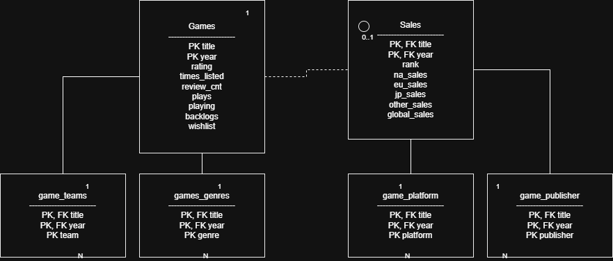

Tables:

* **Games ↔ Sales is a 1-to-1 optional relationship (0..1).**

  * A **Game** may have **zero or one** Sales record
  * A **Sales** record may have **zero or one** Game
* **Games → game_teams** : **one-to-many**
* **Games → games_genres** : **one-to-many**
* **Games → game_platform** : **one-to-many**
* **Games → game_publisher** : **one-to-many**
