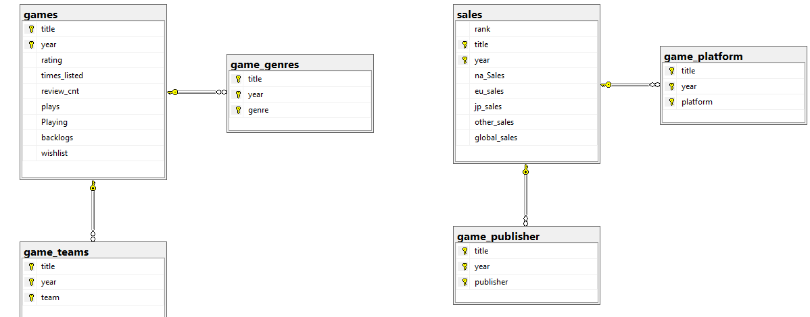

Tables:

* **Dataset Directory:** Contains all the data files we need.
* **ETL.sql:** Establishes relationships between tables and evaluations.
* **preprocessing.ipynb:** Handles all preprocessing and loading into SQL Server.
* **powerbi_dashboard:** Contains the dashboard.
* **project_report:** Project report.
* **requirements.txt:** Lists all the libraries needed for preprocessing.
